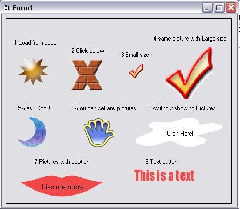



## Create your own button with any shape\!

### Description

Create your own button with any shape!If you want to have your program with professional and beautiful appearance , you can use this UserControl .Thanks for downloading this program and please post your comment about my program(good/bad).
 
### More Info
 

             |
---                |---
**Submitted On**   |2005-01-07 14:12:26
**By**             |[Mostafa Asgari](https://github.com/Planet-Source-Code/PSCIndex/blob/master/ByAuthor/mostafa-asgari.md)
**Level**          |Advanced
**User Rating**    |5.0 (40 globes from 8 users)
**Compatibility**  |VB 6\.0
**Category**       |[Custom Controls/ Forms/  Menus](https://github.com/Planet-Source-Code/PSCIndex/blob/master/ByCategory/custom-controls-forms-menus__1-4.md)
**World**          |[Visual Basic](https://github.com/Planet-Source-Code/PSCIndex/blob/master/ByWorld/visual-basic.md)
**Archive File**   |[Create\_you183779182005\.zip](https://github.com/Planet-Source-Code/mostafa-asgari-create-your-own-button-with-any-shape__1-58149/archive/master.zip)

